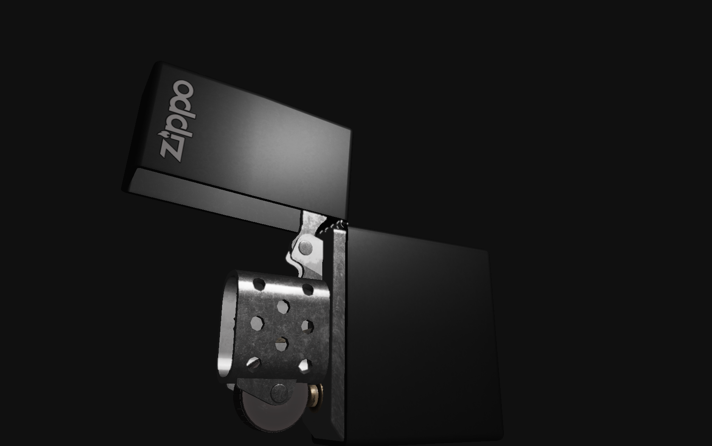

Clone the repository with submodules 
``` bash
git clone --recursive https://github.com/zjypls/OpenGL_Render.git
```
Build
``` bash
cd OpenGL_Render
cmake -B build
cmake --build build -j 4
```
PBR(shots):

Raytracing(shots):

Animation(shots):

